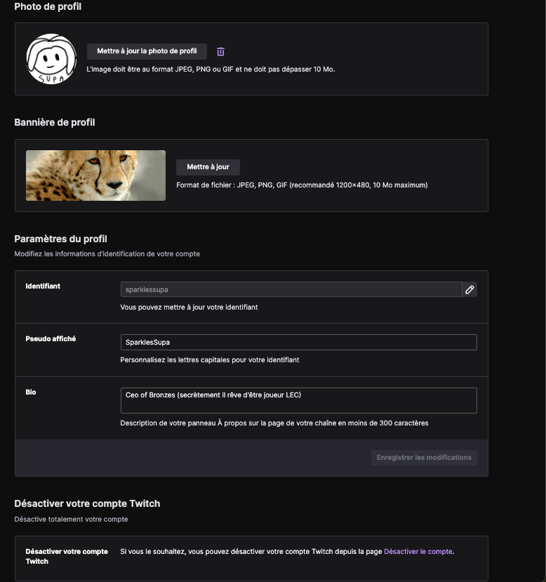
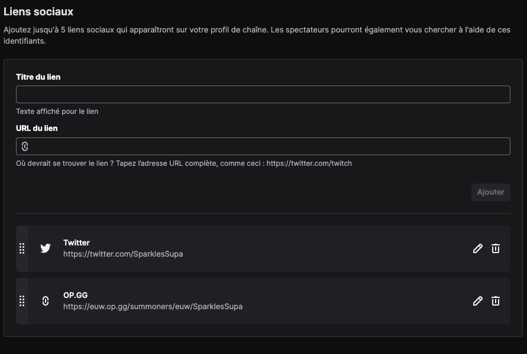
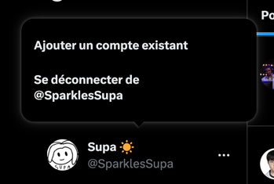
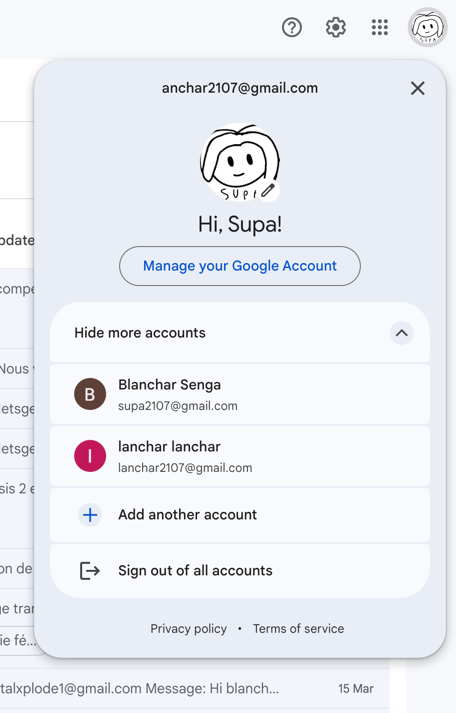

# Arborescence
Voici comment va se découper l'application

## fonctionnalité
- Créer son compte
- Pouvoir créer plusieurs profils (soit coach, soit joueurs)
- Se connecter sur son profil
- Indiquer le type de profil (Joueur, Staff, Ligue, ou Structure)
- Ajouter/Modifier des informations (Compétences, palmarès, expérience)
- Lister 3 Compétences forts parmis les plusieurs qui existent (compétence fun aussi) (classé par ordre d’importance Or, Argent, Bronze) 
- Afficher les différents réseaux sociaux (Twitter, Twitch, YouTube)
- Faire des posts 
- republier les posts
- liker les posts
- Commenter les posts
- Faire des posts de recrutement
- Envoyer des messages
- Afficher les avis favorables à notre encontre et les personnes du milieu qu’on pourrait avoir comme référents.
- Faire des appels [pas dans l’app]
- Avoir un enregistrement de l'appel en question (avec possibilité d'ajouter des notes) [Option payante]
- Voir qui a visité notre profil [Option payante]
- Suivre des personnes
- Avoir des personnes en favoris dans ce que l'on suit (avec notification à chaque post)
- Pouvoir passer d'un compte personnel à un compte d'équipe ou de ligue (switch de compte)
- Recherche rapide 
- Lier ses comptes du jeu à son compte de l’application. 
- Afficher la position actuelle dans le classement du jeu / la position maximale atteinte du joueur. 
- Afficher l'équipe à laquelle je suis actuellement affilié
- Indiquer si je suis en recherche d'une équipe ou non
- Consulter les plannings de l'équipe et le chat de l'équipe (Optionnel)
- Rechercher une équipe
- Rechercher un duo
- Poster des annonces pour une duo spontanée ou une recherche de duo sérieux (sur le profil comme Tinder ?)
- Posséder un badge certifiant si l'on est professionnel/professionnelle (afin de les différencier des amateurs)
- résumé des statistiques des duoos
- Voir les derniers duoos ?
- Liens de partage vers réseaux vers d'autres réseaux
- Enregistre le CV
- Enregistrer plusieurs compte Riot ? (historique avec tous ces comptes en meme temps)
- avoir une liste d'amis ?
- afficher les abonnement les non abonnements
- afficher les langues qu'on peut parler
- Post de recrutement (dans le menu de création d'un post)
- livres d'or
- Se créer une équipe ?
- recherche d'équipe contre une autre équipe
- Donner des roles aux membre de l'équipe
- promo du shop ? pas maintenant (compte bot pour faire du contenu)
- ne pas être vu dans la recherche d'équipe
- créer des images lft ou génerer des CV ?
- Listé les informations du joueurs en plus de ça bio (nom, prénonm, pays, region dans le jeu, region precedentes dans le jeu, equipe actuelle, role, favorite champ, pseduo ?, ancienne équipe, date d'entrée et sorti dans les équipes, classement des saisons passés)
- liens vers des interviews / matchs
- peak de l'élo et pick élo fin de saison
- stats générales (win-lose, winrate, kda generale, cs par minute, Kill participation)
- filtres par langues, jeux, genre, rangs, etc
- track les parties faites en duooo
- recherche entre smurf
- Faire des demandes spontanée
- Bloquer les gens que tu ne connais pas
- Suivre des gens entre eux (réseaux)
- Compte par défaut

## Avancement du projet
- [] Wireframe
- [] Design (+ message d'erreur/ toast/ alert)
- [] Intégration
- [] Script
- [] Message d'erreur

## liste de toutes les fonctionnalités à placer

## Page de presentation de lol : LOL LFT
- à definir

## Se connecter
### Formulaire
- champ : email/nom d'utilisateur
- champ : mot de passe
- champ se souvenir de moi
- Bouton de connexion
### Liens
- Mot de passé oublié
- Se connecter avec google et ou Riot Games
### call to action
- Bouton s'inscrire
- Bouton s'inscrire avec Google
- Bouton s'inscrire avec Riot

### Footer
- Privacy ?
### Select
Select pour changer de lang

## Mot de passe oublié (envoie de mail)
## Reinitialiser le Mot de passe

## S'inscrire
### Select
Select pour changer de lang
### Formulaire 1
- champ : Email/Nom d'utilisateur
- champ : mot de passe
### Formulaire 2
- Champ : Nom
- Champ : Prénom
- Champ : Pseudo officiel
- Date de naissance
### lien
- déjà un compte ?
- S'authentifier avec google
### checkboxes
- I have read and understood, and consent Terms & Conditions.
- I have read and understood, and consent Privacy Policy.
### liens
- S'authentifier avec riot
- S'authentifier avec google chrome

## OnBoarding
- Dire si on veut utiliser discord
### Formulaire 1
- Select : Comment voulez vous afficher votre pseudo
- Option : Pseudo
- Option : Pseudo + Nom + Prénom (tyler ninja blevins)
- Option : Prénom + Nom
- Champ : Choisir son "@" ?
- MultiSelect : Choisir les langues qu'on veut parler
### Formulaire 2
- Liens/Bouton : Ajouter un compte league of legends
### Formulaire 3
Liens 
#### Fieldset: Ajouter ses réseaux sociaux ici (twitter, Discord, youtube, Twitch, Liguepedia)
- Champ : titre du lien
- Champ : url du lien
- Bouton ajouter
#### card des liens déjà ajouter
- Bouton : supprimer
- Bouton : modifier
- Draggable
- icon : icone lien
- paragraphe : nom du lien
- paragraphe : url du lien

## Paramètre
## Profil (générale)
### Profile + Modal ajouter une experience
### Profile + Modal ajouter une compétence + créer des compétences
- Les 3 compétences clés
### Ajouter une biographie
### Télécharger une image du CV ou un CV (faire une image générique)
### Autres
- Centre d'intérêts
- Personnages favoris
- Œuvres favorites
- Application favorites
- Musiques favoris

### Onboarding + profile

## Profile Joueur
## Profile Staff
## Profil équipe ?
## Profil Duoo ?

## Paramètre

### Paramètre + Profil
### Paramètre + Profil

## Changement de compte

## Recherche D'équipe / se faire recruter
## recherche de profil simple
## Post
## Messagerie (type twitter / vinted)
## Notification 
## Match history
## Livres d'or
## Demande (par la messagerie ?)