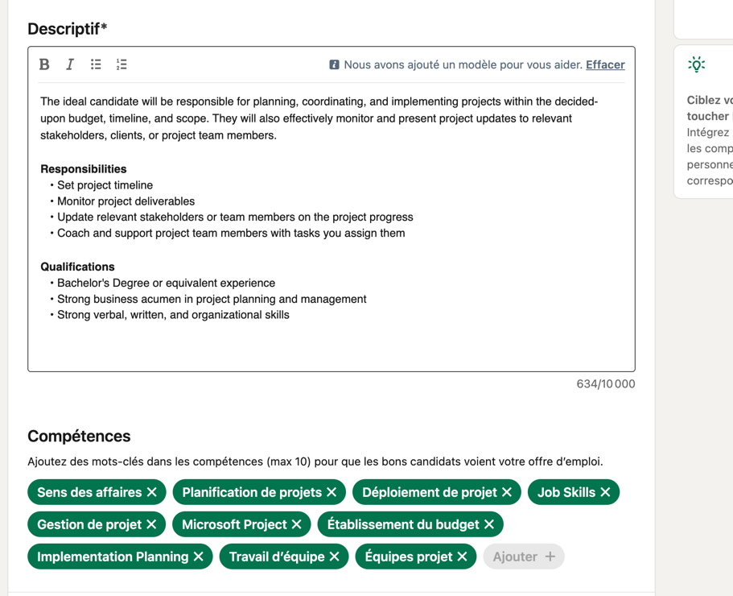
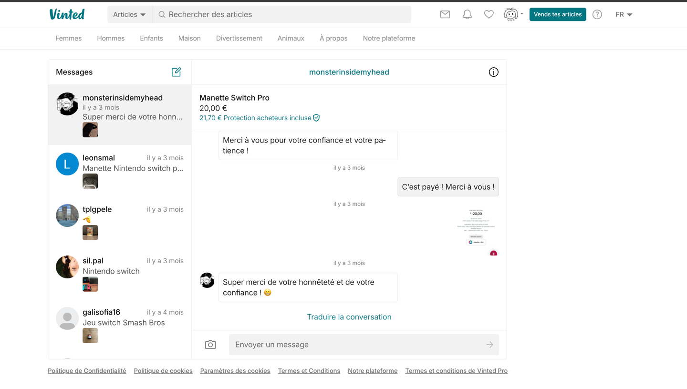
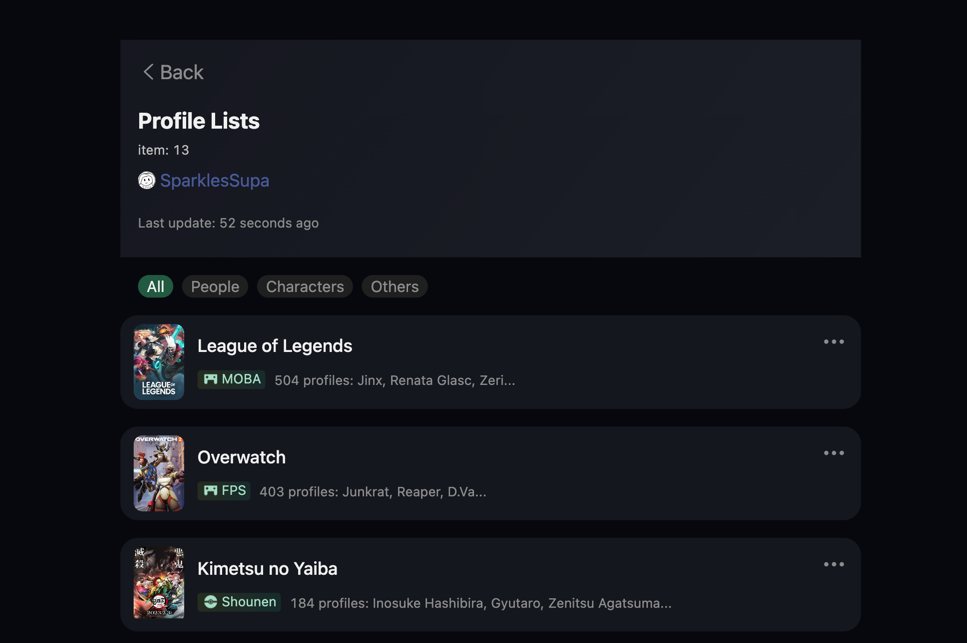

# Arborescence
Voici comment va se découper l'application :

## Page : page de presentation de lol : LOL LFT
à definir
## Page : Se connecter
### Le Formulaire 
- H1 / Logo : Se connecter !
- champ : email/nom d'utilisateur
- champ : mot de passe
- champ se souvenir de moi
- Bouton de connexion
### Les liens dans la page
- Mot de passé oublié
- Se connecter avec google et ou Riot Games
### Les Call to action
- Bouton s'inscrire
- Bouton s'inscrire avec Google
- Bouton s'inscrire avec Riot

### Le footer
- Privacy ?
### Un Select
- Select : pour changer de lang

## Page : Mot de passe oublié (envoie de mail)
- S'inspirer du login
## Page :  Reinitialiser le Mot de passe
- S'inspirer du login

## Page : S'inscrire
### Select
- Select : pour changer de lang
### Formulaire 1
- Champ : Email/Nom d'utilisateur
- Champ : mot de passe
- Champ : mot de passe confirmé
- Bouton : S'inscrire avec Google 
- Bouton : S'inscrire avec Riot

### Formulaire 2
- Champ : Nom
- Champ : Prénom
- Champ : Pseudo officiel
- Date de naissance

### lien
- déjà un compte ?
- S'authentifier avec google
### checkboxes
- I have read and understood, and consent Terms & Conditions.
- I have read and understood, and consent Privacy Policy.
### liens
- S'authentifier avec riot (on autorise que le compte principale pour l'instant)
- S'authentifier avec google chrome

## OnBoarding
- Demander si on veut utiliser discord ?
### Formulaire 1
- Select : Comment voulez vous afficher votre pseudo
- Option : Pseudo
- Option : Pseudo + Nom + Prénom (tyler ninja blevins)
- Option : Prénom + Nom
- Champ : Choisir son "@" ?
- MultiSelect : Choisir les langues qu'on veut parler
- Choisir une photo
- Choisir une bannière
- Select : region
### Formulaire 2
- Liens/Bouton : Ajouter un compte league of legends

## Element sur toutes les pages de l'app
### Nav - sidebar
#### liens
- Profil
- Rechercher une équipe/un Duo
- Paramètres
- Messages
- Notifications
- ajouter/changer de compte
- Se déconnecter

### Modale
#### Fieldset: Ajouter ses réseaux sociaux ici (twitter, Discord, youtube, Twitch, Liguepedia)
- Champ : titre du lien
- Champ : url du lien
- Bouton ajouter

#### card des liens déjà ajouter
- Bouton : supprimer
- Bouton : modifier
- Draggable
- icon : icone lien
- paragraphe : nom du lien
- paragraphe : url du lien

### Barre de recherche classique
- Soit dans le header soit dans l'aside

#### option

#### Page avec résultat

#### Page sans résultat

### Nav header
- Logo du site ?
- Profil (mon compte)
- langue
- Recherche

### Aside
- Jauge sur le profil pour compléter les information
- Proposer des profils ?
- Proposer d'améliorer son interface (rajouter une bio des photos)
- Onboarding

#### Board : indiquer 
- afficher les langues qu'on peut parler
- Veut vocal ou non
- autres infos comme dans un CV ?
- Nationalité ?
- A la recherche de (type de mate)
#### Badge 
medailles 1er duo
BFF (il a joué plus 50 fois avec un duo)
1er duo
1er Equi
1er,5e,10e,20é review !

### Div :  Changement de compte
Pouvoir passer d'un compte à un autre
- Pouvoir créer plusieurs profils (soit coach, soit joueurs) (add another account)
- Pouvoir passer d'un compte personnel à un compte d'équipe ou de ligue (switch de compte)

- Img : Photo
- Bouton : Modifier
- Ul :
  - Img : Photo
  - p : nom du compte
  - p : type du cmpote
- Lien : rajouter un compte (ramene vers la création d'un compte)

### bouton
- Bouton : paramètre

## Page : Profil (Joueur amateur)
https://docs.google.com/spreadsheets/d/1QW422aU3T3W7sFjF9gZbs1LiW5hfTzoTllVfbHNWs4M/edit#gid=1663777141
### Hero
- Listé les informations du joueur
    - photo de profil
    - role (option change souvent de roles, joue tout les roles, joue 2,3 roles) + élo (ou role à niveau proféssionnelle)
    - nom, prénom OU/ET pseudo,
    - pays, region dans le jeu,
    - Lien des réseaux sociaux
    - looking for duoo tag actif ou non (Voyant)
    - Equipe Actuelle (option pas d'équipe/LFT)
    - Faire aussi de l'onboarding ? (voir linkedin)
    - Posséder un badge certifiant si l'on est professionnel/professionnelle (afin de les différencier des amateurs)
    - Lien : facebook, Twitter, Insta (autant qu'on veut (voir youtube baniere + twitch))

### main
#### nav secondaire
- profil
- Historique des parties
- Stats
- Livre d'or / commentaires
- More about me
- Galerie des meilleurs moves

#### Bio
- Titre : Bio
- p : Je joue à league depuis...

#### section CV
- Div : card section
  - Titre
  - Montre une photo du CV

#### section ce que je recherche
Roles avec qui je voudrais jouer, langue parler, age, sexe ?,

#### Section Titre/Awward + Modale
- Photo : Fausse photo
- Titre : Nom du titre
- p : Date
- p : Ligue
  

#### Section palmarès + modal tout affiché + Modale affiché plus
- Photo : Place arrivé (coloré en fonction de la place)
- Titre : nom de l'équipe
- p : Ligue de l'equipe
- p : Date
  
  

#### Modale : ajouter un poste/une experience
- Champ : Poste
- Champ : Entreprise / Org
- Champ : Description
- Champ : Début (mois et année)
- Champ : fin (mois et année)

#### Expérience
- Photo : de l'équipe entreprise
- Titre : nom du poste
- p : Durée
- P : Lieu
  

#### Formation
- Photo : de l'école
- Titre : nom de l'ecole
- p : Durée de la fomation
- P : Lieu
  

#### Compétences/Qualités (il peut décrire tous sa dans sa bio ?)
- Les 3 Compétences forts
- Les 3 Meilleurs qualités
- Les 3 Champs du Signature

#### Modale : ajouter un poste/une experience
- Champ : Poste
- Champ : Entreprise / Org
- Champ : Description
- Champ : Début (mois et année)
- Champ : fin (mois et année)
  

#### Modale : ajouter une Formation
- Champ : école
- Champ : Diplome
- Champ : Domaines d'études
- Champ : Début (mois et année)
- Champ : fin (mois et année)
- Description

#### Modale : ajouter une compétence + créer des compétences
- Les 3 compétences clés
- Champ Compétences 1
- Ou je l'ai apprise (si on veut)

##### Section : article (optionnelle)
- url : url de l'article
- url du champ : nom de l'article

### Main : Duos / equipe (flex)
- Stats avec Duo
- Afficahge en temps réel de se que font mes duoos
- Track les parties faites en duooo

#### Cartes
- roles recherchés
- niveau moyen de l'équipe
- fun / tryhard

### Main : Match history

#### card data!
- Titre : type de partie (ranked ou normal)
- color : Win ou lose (couleur)
- img : Champion joué
- p : KDA 
- p kill/death/assists
- p :K/P
- p : Date
- img + p = Equipe ne face + blase
- p : temps de la pertie
- p : CS
- p : elo moyen
- img : Summoners ?
- runes ?
- build ?
- jauge : Damage ?

### Main : Stats
#### section Elo

- Select : Mode (ou nav/tab)
  - Option : Ranked solo
  - Option : Ranked flex
- img : Logo de l'élo
- titre : Elo actuelle 
- sous-tire : Nombre de lp
- p : Top sur le serveur + classement
- p: Nombre de game joués 
- p : winrate (nombre de w- nombre de l)
- Peak élo

#### Section : infos sur les 20 dernieres games
###### nav/tab 
  - All
  - Normal
  - Ranked
  - Flex

- Titre : Stat génerale 
  - Ratio win/lose
  - KDA
  - Kill participation
- titre : stat sur les 3 champs les plus joués
  - Img : photo du champ
  - p : winrate (7W - 3L), KDA
- Titre : Graphiques des positions joués
  - input : jauge
  - img Logo du role

#### Section : Elo graphic

#### Section : Champions Stats

- Select : Mode
  - Option : Ranked
  - Option : Flex
  - Option : Normal
  - Option : All
- Liste
  - ##### Champion card
    - Img : photo du champ
    - Titre : nom du champion
    - P : CS (CS MIN)
    - p : KDA
    - p : winrate
    - p : nombre de game

#### Section : last season
- Titre : nom de la season
###### Card 
- Titre : Peak élo
  - titre : elo
  - Nombre de w / nombre de lose (winrate)
  - Date
- Titre : Fin de season
  - titre : elo
  - Nombre de w / nombre de lose (winrate)
  - Date

### Main : Livres d'or
Afficher les avis favorables à l'encontre des joueurs et les personnes du milieu qu’on pourrait avoir comme référents.

### card livres d'or / Référant

- Img : Photo de profil
- Gras : Nom de l'utilisatuer
- sous le gras : Rapport avec la personne
- p : Metier
- p : Commentaire
- p : Date

### Main : more aboute me
- Centre d'intérêts
- Personnages favoris
- Œuvres favorites
- Application favorites
- Musiques favoris

#### exemple en photo :

### Main : Galerie des meilleurs moves
Dowload un move (youtube, league ?)

## Page : Profil (Staff)
https://docs.google.com/spreadsheets/d/1QW422aU3T3W7sFjF9gZbs1LiW5hfTzoTllVfbHNWs4M/edit#gid=1429931342
### Hero
- Listé les informations du joueur
  - photo de profil
  - metier
  - nom, prénom OU/ET pseudo,
  - pays, region dans le jeu,
  - Lien des reseaux sociaux
  - Equipe Actuelle (option pas d'équipe/LFT)
  - Faire aussi de l'onboarding ? (voir linkedin)
  - Posséder un badge certifiant si l'on est professionnel/professionnelle (afin de les différencier des amateurs)
  - Lien : facebook, Twitter, Insta (autant qu'on veut (voir youtube bannière + twitch))

### main
#### nav secondaire
- profil
- Livre d'or / commentaires
- More about me (centre d'intérêt)

#### Bio
- Titre : Bio
- p : Je joue à league depuis...

#### section CV
- Div : card section
  - Titre
  - Montre une photo du CV

#### Section palmarès + modal tout affiché
- Photo : Place arrivé (coloré en fonction de la place)
- Titre : nom de l'équipe
- p : Ligue de l'equipe
- p : Date
  
  

#### Section Titre/Awward + Modale
- Photo : Fausse photo
- Titre : Nom du titre
- p : Date
- p : Ligue
  

#### Expérience
- Photo : de l'équipe entreprise
- Titre : nom du poste
- p : Durée
- P : Lieu

#### Formation
- Photo : de l'école
- Titre : nom de l'ecole
- p : Durée de la fomation
- P : Lieu

#### Points forts
- Les 3 Compétences forts
- Les 3 Meilleurs qualités
- Les 3 Champs du Signature  

#### Modale : ajouter un poste/une experience
- Champ : Poste
- Champ : Entreprise / Org
- Champ : Description
- Champ : Début (mois et année)
- Champ : fin (mois et année)
  

#### Modale : ajouter une Formation
- Champ : école
- Champ : Diplome
- Champ : Domaines d'études
- Champ : Début (mois et année)
- Champ : fin (mois et année)
- Description

#### Modale : ajouter une compétence + créer des compétences
- Les 3 compétences clés
- Les 3 Champions signature
- Les 3 qualités/sofkils

#### Section : article
- article sur le gars

### Sub-Page more aboute me
- Centre d'intérêts
- Personnages favoris
- Œuvres favorites
- Application favorites
- Musiques favoris

## Page : se créer une équipe
### Formulaire 1
- Option : Nom de l'équipe
- Champ : Choisir son "@" ?
- Input : Photo de l'équipe 
- Input : Bannière
- MultiSelect : Choisir les langues qu'on veut parler
- Champ : site
- Champ : ambition (gagner la Lec, Gagner une lane)
- Checkbox : Je certifie être mandataire de cette organisation et disposer du droit d’agir en son compte pour créer et gérer cette page. L’organisation et moi-même acceptons les conditions supplémentaires des Pages.
### Formulaire 2
Ajouter un joueur
- Liens/Bouton : Ajouter des gens dans l'équipe /
- input : nom de l'utilsateur (pré remplir)
- role / staff
- nationalité

Ajouter un staff
Role
Nationalité

## Page Profil équipe ?
https://docs.google.com/spreadsheets/d/1QW422aU3T3W7sFjF9gZbs1LiW5hfTzoTllVfbHNWs4M/edit#gid=1982700800
### Hero
- Listé les informations de l'équiope
  - Photo de profil
  - Metier (Equipe lol (pros))
  - Nom, prénom OU/ET pseudo,
  - Pays, region dans le jeu, 
  - Langues
  - Lien des reseaux sociaux
  - Faire aussi de l'onboarding ? (voir linkedin)
  - Posséder un badge certifiant si l'on est professionnel/professionnelle (afin de les différencier des amateurs)
  - Lien : facebook, Twitter, Insta (autant qu'on veut (voir youtube bannière + twitch))
    
    

### Aside
- Jauge sur le profil pour pour compléter les information
- Proposer des profils ?
- Proposer d'améliorer son interface (rajouter un bio des photos)
- Onboarding
  
- Autres infos comme dans un CV ?
- Date de création
- Owner
- Ligue dans laquelle c'est jouer
- Site web
- Numero de tél / email

### main
#### nav secondaire
- profil
- Historique des parties
- Stats
- More about us
- Galerie des meilleurs moves

#### Bio
- Titre : Bio
- p : Je joue à league depuis...

#### Section palmarès + modal tout affiché
- Photo : Place arrivé (coloré en fonction de la place)
- Titre : nom de l'équipe
- p : Ligue de l'equipe
- p : Date
  
  

#### Section Titre/Awward + Modale
- Photo : Fausse photo
- Titre : Nom du titre
- p : Date
- p : Ligue
  

#### Membre de l'équipe (comme lol pros)
- Titre : Membres
- Card :
  - Icone du roles
  - Drapeau du pays
  - date d'arrivé
  - logo du élo - élo

#### Staff de l'équipe (comme lol pros)
- Titre : Membres
- Card :
  - Drapeau du pays
  - date d'arrivé

#### Previous member
  (liste de tout les membres passé comme la liste de membres de l'équipe)

l'ajout de membres doit se faire par la surface administrateur 
- soit manuellement (en ajoutant les pseudos de gens)
- soit en ajoutant le compte et/ou le profile
- ajouer un membres qui a un compte existant ou non

#### historiques de l'équipe (faut être plus de 3) ?
- oppgg de team

#### best moves / games
- move (avec vocale de préference d'équipe (voice cooms))

#### liens des games officiel ?
- ul : liens des games

#### liens des article
- ul : liens des articles

### main : on recrute
afficher vide avec un + pour ajouter des demandes via une modale

## Page : Recherche de duo /équipe
- Bouton : Faire un posts de recrutement
### Section : Filtre
- Checkbox : certifie only (être dans la banque de riot les 2 dernier années)
- Select Type : Duos / Equipe / Staff 
- Select Ambition : Fun / Clash / Pros / Flex / tout, ERL / TOURNOI
- Select niveau de jeu : élo
- Select langues : fr / en
- Select Region :
- Select Roles :
- Select Champion :
- Select interet
- Select date
### main
#### Bouton retirer mon poste / enelever la visibilité de mon poste
#### Me mettre en recherche
- bouton : qui va afficher notre lft poste
#### Modifier mon LFT/LFM POST
#### Request Card (JOUEUR/TEAM)
- img : photo de profile
- P : pseudo
- p : Elo
- P : role / métier ()
- p : Region
- p : nombre de L / nombre de win (winrate)
- P : Kda : générale
- p : Ambtion [fun, clash, ERL]
- p : Bio
- P : Compétences (3)
- p : Champion joué (5)

- ul : à la recherche de 
  - p : role / metier
  - p : compétences
  - p / img : champions ?

- Bouton : Voir le profil
- Bouton : Envoyer une demande d'ami / duo / message

#### Request Card (STAFF)
- img : photo de profile
- P : pseudo
- p : Elo
- P : role / métier
- p : Region
- p : Ambtion [fun, clash, ERL]
- p : Bio
- P : Compétences (3)

- Bouton : Voir le profil
- Bouton : Envoyer une demande d'ami / duo / message

## Page: Messagerie (type twitter / vinted)
- Voir photos

### Tabs
- Img : photo de profil de la personne à qui ont parle
- P : pseudo de la personne
- Temps : du dernier message envoyé
- p : dernier message envoyer

### chat
- voir chat twitter

## Page : Notification

### ul
#### card
- img : icone de la notification
- P : pseudo
- Boutton accepter demande de duo
- p : heure de la demande, temps depuis la demande

#### Se créer une équipe ?
- Donner des roles aux membres de l'équipe et au staff
   onboarding

## Créer plusieurs profils
- Route register

## Page : Paramètre
### nav
Information du compte
Confidentialité et sécurité
Notification

### sub-page : Information du compte
#### Section : identité du profil
Champ : Prénom
Champ : Nom d’utilisateur
Champ : Pseudo officiel
Champ/Select : Nom affiché
Champ : Nom @
Champ : Type de compte
Bouton : enregistrer

#### Section : information sur l'utilisateurs
Champ : Email
Champ : Pays
Champ : langue
Champ : Sexe
Champ : Date de naissance
Bouton : enregistrer

### sub-page : Sécurite et confidentialité
Checkbox : Désactiver les messages d’user non certifié
Checkbox : Désactiver les demandes d’équipe non certifié

### sub-page : Notification
Checkbox : Désactiver les notifs
Checkbox : Désactiver les mails

## Page : Paramètre
- Changer
  - Avatar
  - pseudo
  - langue (select)

### Form
#### Cv
Bouton : charger le CV
(moins de 5mo + verifier le type (PDF ONLY))

## Fonctionnalités pas pris en compte
- Page more avec moi avec les preferences comme dand pdb
- 
- 
- Les post
- Enregistrer plusieurs compte Riot ? (historique avec tous ces comptes en meme temps)
- Faire des posts
- republier les posts
- liker les posts
- Commenter les posts
- Suivre des personnes
- Avoir des personnes en favoris dans ce que l'on suit (avec notification à chaque post)
- Faire des appels [pas dans l’app]
- Avoir un enregistrement de l'appel en question (avec possibilité d'ajouter des notes) [Option payante]
- Voir qui a visité notre profil [Option payante]
- Recherche rapide
- Lier ses comptes du jeu à son compte de l’application.
- Consulter les plannings de l'équipe et le chat de l'équipe (Optionnel)
- Indiquer si je suis en recherche d'une équipe ou non
- Poster des annonces pour une duo spontanée ou une recherche de duo sérieux (sur le profil comme Tinder ?)
- afficher les abonnement les non abonnements
- promo du shop ? pas maintenant (compte bot pour faire du contenu)
- recherche d'équipe contre une autre équipe
- créer des images lft ou génerer des CV ?
- Faire des demandes spontanée
- Suivre des gens entre eux (réseaux)

Couleur :
- Couleur or et vert de league of legends
- Catppuicin theme 'le plus clair des 3 foncés'
- Solarizd dark (lune)
- Nord (voit jetbrains theme)

Typo :
- Gibson
- INter
- Poppins

moodboard
- Tec
- Laracast
- Forem

Parametre : Affichage (Pas mnt)
Parametre : Preference (pas mnt)
bloquer les gens (pas mnt)