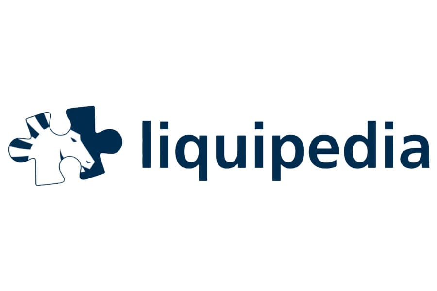
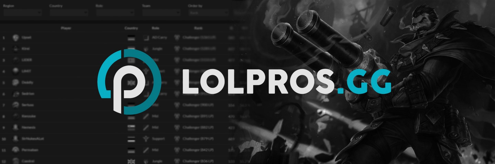

# 📝 LFT-LoL
Une Application qui permettrait de trouver des compagnons de jeu sur League of legends afin de progresser sur le jeu.

//mettre une image

## 💬 Contexte
League of legends est un jeu vidéo de stratégie sorti en 2009 développé par Riot Games. C'est un jeu qui se joue en 5 contre 5 dont le but est de détruire la base de l'équipe adverse en premier.

Au fil des années, le jeu gagna en popularité et engendra une scène competitive ou des joueurs de haut niveau s'affronte pour l'obtention de Trophées. De plus en plus de structures (Organisations) se sont mis à payer des salaires à ces joueurs de haut niveau, mais aussi des coachs, des assistants coachs, analystes et autres staffs afin de remporter ces trophées. Partout dans le monde des championnats officiels ont vu le jour et ceux-ci sont diffusé à travers le monde à des centaines de milliers de spectateurs. Un vrai écosystème professionnel est né avec des métiers propres à cet environnement.

 Étant un milieu très convoité énormément de personnes essaient de se trouver une voix là-dedans aussi bien en tant que joueurs que coach, commentateur, observateur ou encore gérant d'une ligue, mais c'est loin d'être une chose facile… 

Actuellement les gens qui veulent se lancer dans ce domaine utilise twitter, Discord ou Encore des Google sheets qui ne permettent pas la visibilité recherchée.

## 👩 Public ciblé (Persona)

### Joueur amateur
>  « Je veux partager mon experience de jeu »

- Liées son compte avec son compte du jeu.
- Pouvoir se chercher un duo (équipe juste de 2)
- Pouvoir se chercher une équipe pour un futur clash, un tournoi, monter le classement en groupe ou juste jouer avec des gens.
- Envoyer des messages à mon groupe, ou juste avec un ami.
- Mettre ses compétences en avant sur mon profil
- Résumé des dernières parties de jeu (ou non)
- Avoir un résumé des statistiques de mes comptes sur mon profil (ou non)
- Partager mon profil sur d'autres réseaux (générer une image qui résume notre profil)
- Choisir pouvoir lister tous ces comptes
- Voir les statistiques avec son duo/son équipe (suivi des parties)
- Avoir une liste d'ami
- Faire des posts
- Afficher les langues qu'on peut parler et le niveau
- Montrer qu'on recherche une équipe ou qu'on recrute
- Suivre des profils
- Républier des posts
- Post de pour dire que je recrute ou que je recherche
- recherche de duo spontanée ? (lang, rang, rôle)

### Joueur professionnel
>  « Je veux gagner ma vie en jouant »

En plus de pouvoir faire ce qu'un joueur amateur peut faire
- Définir son profil comme celui d'un staff (ne pas avoir les infos liées aux historiques)
- Qu'on voit mon palmarès
- Avoir un profil pro (badge, onglet de recherche de team rservé aux pros ou juste filtre, se faire accoster que par des structures officielles)
- Avoir des livres d'or avec les appreciations d'ancien referent
- Faire des posts recherches s'emploie

### Structure/Équipe
>  « Je veux remporter des trophées »

- Se créer une équipe
- Recruter des membres dans mon équipe
- Avoir un profil pour l'équipe
- Se chercher une ligue
- Chercher une équipe qui veut se battre contre
- Avoir des remplaçants
- placer des roles sur les gens (joueurs + roles sur le jeu, ceo, coach, observateurs, managers, analystes, community manager)

### Staff
>  « Je veux apporter mes compétences à mon équipe »

En plus de pouvoir faire ce qu'un joueur amateur peut faire
- Définir son profil comme celui d'un staff (ne pas avoir les infos liées aux parties)
- Listé ses compétences, son palmarès, ses formations et info générales.

## Futur/Autre Persona
- Staff : Ligue ?, Manager, Community manager, Observateur, Head Coach, Assistant Coach, Positional Coach, Analyste, Directeur sportif (Head of league of legends), coach mentale, commentateurs, régisseur, interviewer et tous les autres metiers reliés de loin ou de près à LOL.
- Broadcast Officiel : Ceux qui diffusent les compétitions
- Fille ? : Être inclusif en proposant des équipes qu'avec des filles, des ligues féminines, etc.

## Résumé des fonctionnalités
- promo du jour dans le shop, skins légendaires dans le shop
- Créer son compte
- Indiquer le type de profil (Joueur, Staff, Ligue ou Structure)
- Se créer des profils secondaires (Joueurs/Staff, Ligue, Équipe)
- Ajouter/Modifier des informations (Compétences, palmarès, expérience)
- Afficher les différents réseaux sociaux (Twitter, Twitch, YouTube)
- Faire des posts
- Faire des posts de recrutement
- Envoyer des messages
- Afficher les compétences (liées à la catégorie de profil que l'on a)
- Afficher les avis favorables à notre encontre et les personnes du milieu qu’on pourrait avoir comme référents.
- Suivre des personnes
- Avoir des personnes en favoris dans ce que l'on suit (avec notification à chaque post)
- Pouvoir passer d'un compte personnel à un compte d'équipe ou de ligue (switch de compte)
- Permettre à plusieurs comptes d’avoir plusieurs profils.
- Recherche rapide
- Indiqué si je suis en recherche d'une équipe ou non
- Gamification

### fonctionnalités plus poussés
- lock son équipe (de 2 ne pas être vu dans la recherche d'équipe)
- 

#### Contextes d’utilisation
Sur pc, on va partir du principe que les gens qui jouent à league of legends ont un pc gamer ou au moins [les configurations de base](https://support-leagueoflegends.riotgames.com/hc/fr/articles/201752654-Configurations-minimales-et-recommand%C3%A9es-League-of-Legends)

- Utilisable sur Téléphone

#### Expertise
League of Legends étant un jeu pour un public averti, les joueurs ont l'habitude d'utilisé un pc. 

#### Lieu d'utilisation
À la maison, sur le pc

## 📈 Analyse de l’existante

### Twitter

| ✅ Pour                                                                                                                                                                                                                                                                                           | ❌ contre                                                                                                                                                                                                                                                             |
|--------------------------------------------------------------------------------------------------------------------------------------------------------------------------------------------------------------------------------------------------------------------------------------------------|----------------------------------------------------------------------------------------------------------------------------------------------------------------------------------------------------------------------------------------------------------------------|
| - Présence de tous les acteurs de la scène League of Legends   - On peut faire des posts   - Utilisé par les joueurs/structures pour diffuser des annonces  - On peut envoyer des messages à d'autres utilisateurs  - on peut suivre d'autres utilisateurs  - Bon onboarding |  - Difficulté de repérer les annonces d'emploi pour l'écosystème League of Legends parmi le flux constant de tweets   - La fonctionnalité de recherche est assez mauvaise en plus de ne pas être adapté pour la recherche de coéquipier et/ou de structure.  |

### Linkedin

| ✅ Pour                                                                                                                                                                                                                                                                                                                                                | ❌ contre                                                                                                                                                                   |
|-------------------------------------------------------------------------------------------------------------------------------------------------------------------------------------------------------------------------------------------------------------------------------------------------------------------------------------------------------|----------------------------------------------------------------------------------------------------------------------------------------------------------------------------|
| - On peut avoir un profil avec des informations comme la formation, expériences, compétences  - On peut créer des post  - On peut rechercher un emploie ou une organisation   - On peut republier des post  - On peut envoyer des messages à d'autres utilisateurs  -  on peut suivre d'autres utilisateurs  - Bon onboarding |   - Non adapté pour les joueurs d'e-sport d'un jeu (notamment league of legend)   - Beaucoup de personne parle d'une atmosphère trop leches-bottes et superficiels |

### LoL FA Discord Public Database

| ✅ Pour                                                                                                                                                                                                                                                                                                                      | ❌ contre                                                                                                                                                    |
|-----------------------------------------------------------------------------------------------------------------------------------------------------------------------------------------------------------------------------------------------------------------------------------------------------------------------------|-------------------------------------------------------------------------------------------------------------------------------------------------------------|
| - Adapté à chaque type de profil dans l'écosystème League of Legends (Joueurs / Structures / Staff / Ligue )   - Facilite le renseignement des informations d’un profil.   - Permet de créer des images LFT associées à un post Twitter.  - Propose une liste de compétences que les joueurs peuvent utiliser.  |   Propose une liste de compétences que les joueurs peuvent utiliser.    - L'interface du tableau Excel a un potentiel d'amélioration considérable.  |

### Discord

| ✅ Pour                                                                  | ❌ contre                                                                                                                                             |
|-------------------------------------------------------------------------|------------------------------------------------------------------------------------------------------------------------------------------------------|
| - Permet de rencontrer directement les équipes presentes dans un league | - Dificile d'acceder aux serveurs depuis internet, un nouveau pratiquant aura du mal à trouver   - Il y a pas toujours des moment de recrutement |

### LiguePedia

| ✅ Pour                                                                                                                                                                                                                                                                                                           | ❌ contre |
|------------------------------------------------------------------------------------------------------------------------------------------------------------------------------------------------------------------------------------------------------------------------------------------------------------------|----------|
| - photo du joueurs  - information genérales sur le joueurs (nom, prénonm, pays, region dans le jeu, region precedentes dans le jeu, equipe actuelle, role, favorite champ, pseduo ?, ancienne équipe, date d'entrée et sorti dans les équipes, classement des saisons passés  - lien vers les interviews | -        |

### Lolpros

| ✅ Pour                                                                                                                                                                                   | ❌ contre                               |
|------------------------------------------------------------------------------------------------------------------------------------------------------------------------------------------|----------------------------------------|
| - On peut voir ces anciennes équipes - On peut voir ses stats sur le classement européens   - graphique de l'historiques de lp   - Peak élo de la saison et élo de fin de saison | - Site réserver exclusivement aux pros |

### GOL.gg

| ✅ Pour                                                                      | ❌ contre                                                        |
|-----------------------------------------------------------------------------|-----------------------------------------------------------------|
| - stats (win-lose, winrate, kda generale, cs par minute, Kill participation | - Statistique de games officiel uniquement)   Stats record  |

### duoo.gg

| ✅ Pour                                                                                                                                                                                                                                                                                                                                                                  | ❌ contre                                                                                                                                                                    |
|-------------------------------------------------------------------------------------------------------------------------------------------------------------------------------------------------------------------------------------------------------------------------------------------------------------------------------------------------------------------------|-----------------------------------------------------------------------------------------------------------------------------------------------------------------------------|
| - Permet de trouver des duoos   - System de review de games    - Système de classement de duo, - filtres par langues, jeux, genre, rangs, etc   track les parties faites en duooo   - On peut se connecter avec Twitch, Riot, Discord et Gmail   - On a un onglet ou on nous suggère des duos et les demandes de duos   - recherche entre smurf | - On ne peut pas trouver de groupe uniquement des duoos   - On ne s'intéresse qu'a des joueurs de league of legends et pas à des gens qui veulent en faire leur métiers |

### Mention honorables (Site que visite souvent les joueurs)
- League of graphs
- Opgg
- Ugg
- Mobalytics (jolies cartes avec un dégradé)
- deep lol
- one tricks.gg
- Championnmastery.gg
- https://euw.whatismymmr.com/
- discord website
- https://lolesports.com/schedule?leagues=lec
- https://www.leagueoflegends.com/en-gb/?utm_medium=card1%2Blolesports.com&utm_source=riotbar

## Site Map
En reflexion

## Wireframe
En Attente

## Moodboard
En Attente

## Design
### Fonts
Manrope ?
En Attente

## Arborescences des fichiers
- Arborescences laravel classiques

## Avancement / Implémentation future
- Recherche de scrim
- Faire des calls ? en 1v1 ? en groupe ?
- Possibilité pour les coachs de proposé de la séance de coaching facturé ?
- Possibilité entre 2 équipes de mettre de l'argent en jeu pour pimenter les choses ?
- Possibilité que je fasse des tournois où il faut une entrée de 5,50 e (je prends les 50 cents).
- Je voudrais aussi qu'elle puisse être utilisée pour faire de la gestion ou que je fasse un app liée à celle-ci (en reflexion)
- Planifier des sessions d'entrainement.
- Notés les duos/les parties en équipes, dans les historiques des parties.
- des tags sur les parties de l'historique pour savoir ce que je veux améliorer ou non.
- Planning pour les équipes avec les matchs à jouer et entertainments
- Faire des appels [pas dans l’app]
- Avoir un enregistrement de l'appel en question (avec possibilité d'ajouter des notes) [Option payante]
- Voir qui a visité notre profil [Option payante]

## Lien utile

### Listes de mes potentiels testeurs

#### Ami proche
Théo,
Bilal,
Abdel,
François,
Lucas,
Troodbeat,
Khoubz,
Gab,
Sin,
Morti,

#### Discord/Twitter mutus
Major,
kazyPasContent,
Doki,
Joestar,
Energiz,
Zboulé (Vlad),

#### Discord ou trouver des gens
LKL / Kcrapule inhouse,
Skypeia league,
Discord League of legends FR,
LoL FA Discord Public Database (la google sheet),
Twitter LOL LFT,